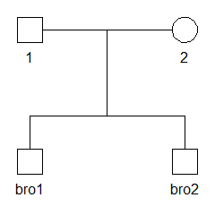
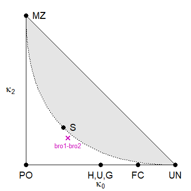

<!-- README.md is generated from README.Rmd. Please edit that file -->
forrel 
=================================================================

Introduction
------------

The goal of `forrel` is to provide forensic pedigree computations and relatedness estimation from genetic marker data. Some of its functionality is derived from the retired `paramlink` package, but updated to comply with the `pedtools` package for handling pedigrees and marker data.

The most important analyses currently supported by forrel are:

-   Simulation of marker data: unconditional or conditional on known genotypes
-   Estimation of IBD (kappa) coefficients from marker data
-   Plotting of IBD coefficients in the IBD triangle
-   Conversion of `Familias` objects to `pedtools::ped` objects

Installation
------------

To get the latest version, install from GitHub as follows:

``` r
 # First install devtools if needed
if(!require(devtools)) install.packages("devtools")

# Install forrel from GitHub
devtools::install_github("magnusdv/forrel")
```

An example
----------

In this short introduction, we first demonstrate simulation of marker data for a pair of siblings. Then - pretending the relationship is unknown to us - we estimate the relatedness between the brothers using the simulated data. If all goes well, the estimate should be close to the expected value for siblings.

To get going, load the `forrel` and `pedtools` packages. The latter is needed for pedigree creation and plotting.

``` r
library(pedtools)
library(forrel)
```

**Create the pedigree**

We start by creating and plotting a pedigree with two brothers, named `bro1` and `bro2`.

``` r
bros = c("bro1", "bro2")
x = nuclearPed(children = bros)
plot(x)
```



**Marker simulation**

Now let us simulate the genotypes of 100 independent SNPs for the brothers. Each sNP has alleles 1 and 2, with equal frequencies by default. This is an example of *unconditional* simulation, since we don't give any genotypes to condition on. Unconditional simulation is performed by simple *gene dropping*, i.e., by drawing random alleles independently for the parents, followed by a "Mendelian coin toss" in each parent-child transmission.

``` r
x = markerSim(x, N = 100, ids = bros, alleles = 1:2, seed = 1234)
#> Unconditional simulation of 100 autosomal markers.
#> Individuals: bro1, bro2
#> Allele frequencies:
#>    1   2
#>  0.5 0.5
#> Mutation model: No 
#> 
#> Simulation finished.
#> Number of calls to the likelihood function: 0.
#> Total time used: 0.25 seconds.
```

Note 1: The `seed` argument is passed onto the random number generator. If you use the same seed, you should get exactly the same results.
Note 2: To suppress the informative messages printed during simulation, add `verbose = FALSE` to the function call.

The pedigree `x` now has 100 markers attached to it. The genotypes of the first few markers are shown when printing `x` to the screen:

``` r
x
#>    id fid mid sex <1> <2> <3> <4> <5>
#>     1   *   *   1 -/- -/- -/- -/- -/-
#>     2   *   *   2 -/- -/- -/- -/- -/-
#>  bro1   1   2   1 1/1 1/2 1/1 2/1 2/2
#>  bro2   1   2   1 2/1 1/2 1/1 2/1 2/2
#> Only 5 (out of 100) markers are shown. See `?print.ped` for options.
```

**Estimation of IBD coefficients**

The `IBDestimate()` function estimates the coefficients of *identity-by-descent* (IBD) between pairs of individuals, from the available marker data.

``` r
k = IBDestimate(x, ids = bros)
k
#>    ID1  ID2   N         k0        k1        k2
#> 1 bro1 bro2 100 0.07331282 0.6067815 0.3199057
```

The theoretical expectation for non-inbred full siblings is (*κ*<sub>0</sub>, *κ*<sub>1</sub>, *κ*<sub>2</sub>)=(0.25, 0.5, 0.25). To get a visual sense of how close our estimate is, it is instructive to plot it in the IBD triangle:

``` r
showInTriangle(k, labels = TRUE)
```


